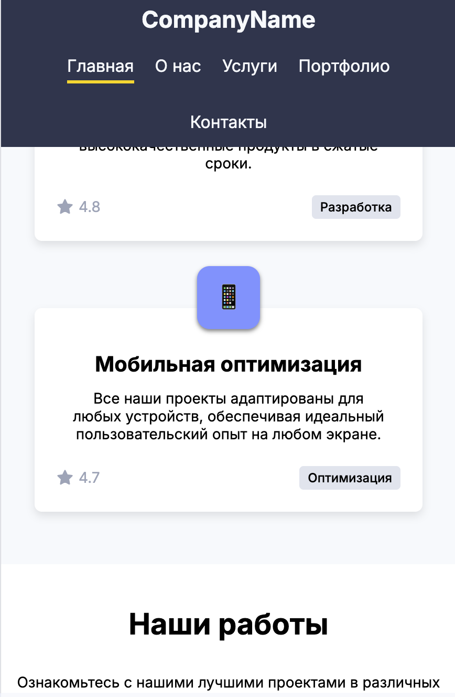
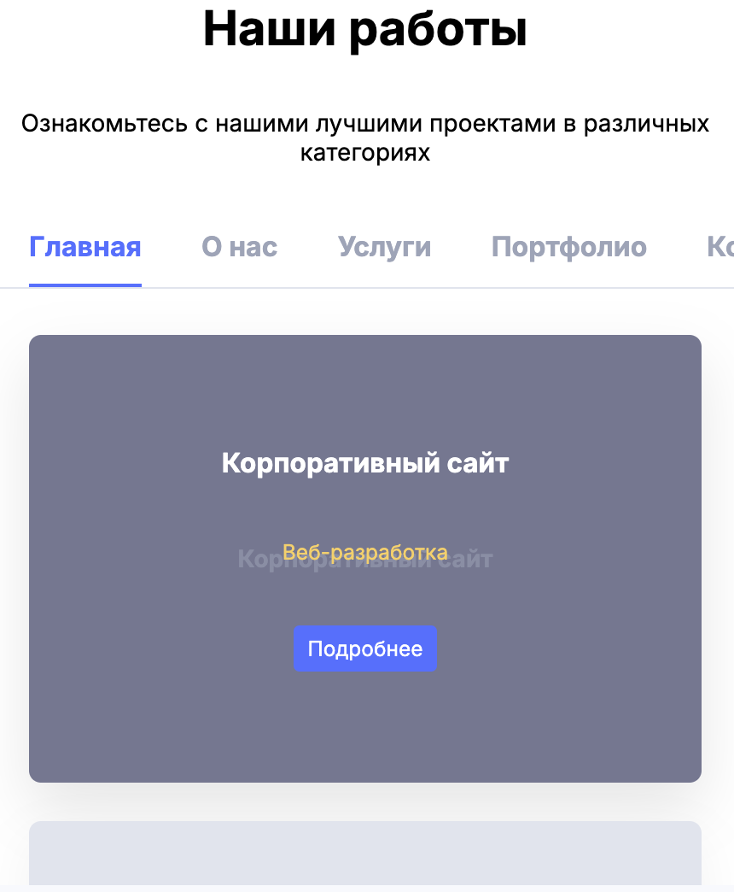

# ForTheTest - Тестовое задание

## Описание проекта

Данный проект представляет собой одностраничное веб-приложение, разработанное в рамках тестового задания. Сайт демонстрирует современный дизайн лендинга для компании, предоставляющей услуги в сфере веб-разработки и дизайна.

## Технологии

- React 18
- TypeScript
- React Router для навигации
- SCSS-модули для стилизации
- Vite в качестве сборщика

## Особенности проекта

- Адаптивный дизайн для всех устройств
- Интерактивные элементы с анимацией при наведении
- Модульная структура компонентов
- Типизация с использованием TypeScript
- Оптимизированная сборка с Vite

## Структура проекта

```
src/
├── assets/         # Статические ресурсы (стили, изображения)
├── components/     # Переиспользуемые компоненты
├── layouts/        # Макеты страниц
├── pages/          # Компоненты страниц
│   ├── ErrorPage/  # Страница ошибки 404
│   ├── HomePage/   # Главная страница
│   └── TestPage/   # Тестовая страница
└── routes.tsx      # Конфигурация маршрутов
```

## Реализованные функции

1. **Шапка сайта** с логотипом и навигационным меню.
2. **Секция "Инновационные решения"** с тремя карточками услуг:
   - Креативный дизайн
   - Быстрая разработка
   - Мобильная оптимизация
3. **Секция "Наши работы"** с интерактивными карточками проектов:
   - При наведении на карточку меняется её внешний вид
   - Отображается дополнительная информация и кнопка "Подробнее"
4. **Навигация** между страницами с использованием React Router.
5. **Адаптивный дизайн** для различных устройств.

## Установка и запуск

### Требования

- Node.js 16.x или выше
- npm 8.x или выше

### Установка зависимостей

```bash
npm install
```

### Запуск проекта

```bash
npm run dev
```

## Превью


